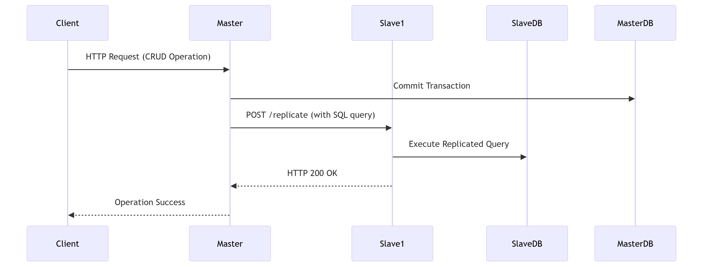
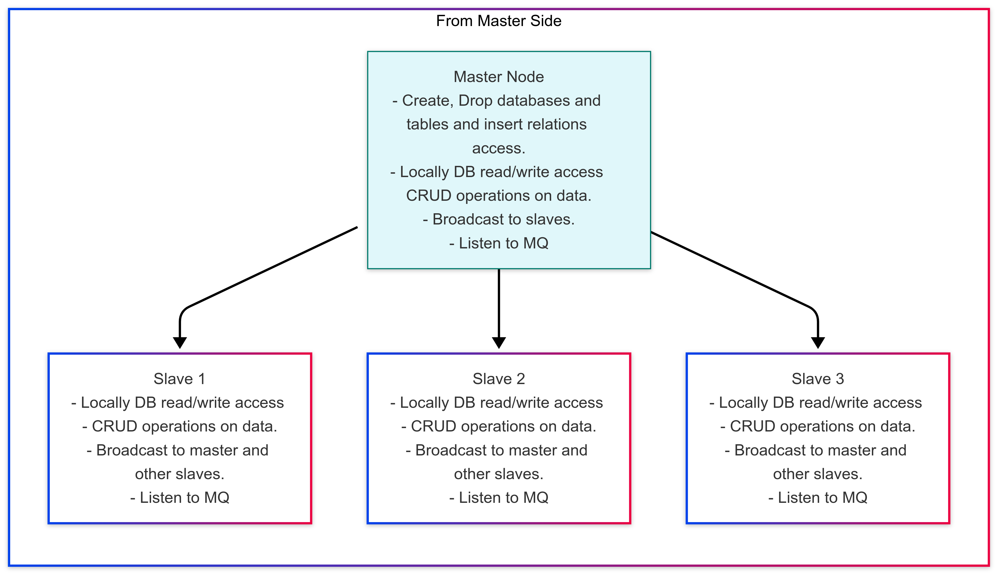

# 🛒 E-Commerce Database Management System

## 📌 Overview

This project is a comprehensive **database management system** for an e-commerce platform, featuring:

- Master-slave replication
- Full CRUD operations
- Web-based administration interface

It manages **customers, products, orders**, and offers advanced **database administration** capabilities.

---

## 📁 Project Structure

ddb_final/
├── crud_operation.go    # Core database operations
├── function.go          # Business logic
├── handler.go           # HTTP controllers  
├── schema.sql           # database schema
├── master.go             # Slave node entry
├── templates/           # HTML views
│   ├── base.html
│   ├── customers.html
│   └── ...
├── static/ # Static assets (CSS, JS, images)
├── go.mod # Go module file
├── go.sum # Go dependencies checksum 
└── README.md


---

## 🚀 Features

### 🔧 Core Functionality

- **Master-Slave Replication**: Automatic synchronization of data changes across multiple database nodes
- **CRUD Operations**: Full create, read, update, and delete functionality for all entities
- **Web Interface**: Clean HTML templates for easy administration
- **Database Management**: Create, modify, and delete databases and tables

### 🗃️ Data Management

- **Customer Management**: Track customer info, order history, and spending
- **Product Inventory**: Manage product details, pricing, and stock levels
- **Order Processing**: Handle creation, modification, and cancellation of orders
- **Order Items**: Detailed tracking of products within each order

### ⚙️ Technical Features

- **Search & Sorting**: Advanced customer search and sorting
- **Database Administration**: Full control over database structure
- **Table Management**: Create, alter, and drop tables with relationships

---

## 🏗️ System Architecture

### Components

- **Master Server**: Handles all write operations
- **Slave Nodes**: Read-only replicas that sync with the master
- **Web Interface**: Admin dashboard for managing the system

### Database Schema (MySQL)

- `users` (customers)
- `products`
- `orders`
- `orderItems` (order line items)

---

## 💻 Installation

### 🔑 Prerequisites

- Go 1.16+
- MySQL 5.7+
- Git

### 🛠️ Setup Instructions

Clone the repository:

```bash
git clone https://github.com/ShimaaAbdalraheem/Master-Slave-Replication/tree/master_
cd ecommerce-dbms
```

Set up environment variables:

```bash
export DBUSER=your_db_username
export DBPASS=your_db_password
```

Initialize the database:

- Create a MySQL database named `ecommerce_db`
- Import the schema from `schema.sql`

Configure slave nodes:

- Update the `snaps` slice in `crud_operation.go` with slave node info
- Ensure each slave node has the replication endpoint running

Build and run:

```bash
go build
./ecommerce-dbms
```

---

## 🌐 Usage

### Accessing the System

- Open your browser at: `http://localhost:8080`
- Use the dashboard for navigation and management

### Key Endpoints

- `/customers` - Manage customer accounts
- `/products` - Manage product inventory
- `/orders` - Process and manage orders
- `/databases` - Database structure control
- `/tables` - Table and relationship management

---

## 🔁 Replication Configuration

The **master node** automatically replicates changes to all configured **slaves**.

To add a new slave node, include its info in the `snaps` slice:

```go
{
    Name:     "node1",
    Address:  "192.168.1.100",
    Port:     "8081",
    Username: "repl_user",
    Database: "ecommerce_db",
}
```

Ensure each slave node exposes a `/replicate` endpoint.

## 🔄 Replication Flow


---
## Structure Diagram

---
## 📚 API Documentation

### 🔄 Replication API

- **Endpoint**: `POST /replicate`
- **Request Body**:

```json
{
  "query": "SQL statement",
  "database": "db_name",
  "user": "db_user",
  "password": "db_password"
}
```

- **Response**: Success/failure message

### 🛠️ CRUD Operations

All CRUD operations are accessible via the web interface. Replication is automatically handled for:

- Customer operations
- Product management
- Order handling
- Database schema changes

---

## 📁 Templates Structure

HTML templates are stored in the `templates/` directory:

- `base.html` – Main layout
- `customers.html` – Customer management
- `products.html` – Product management
- `orders.html` – Order processing
- `databases.html` – DB structure control
- Various forms for create/edit functionality

---

## 🛡️ Error Handling

The system includes:

- Form validation
- Database error feedback
- Replication failure logging
- Custom HTTP error pages

---

## 📈 Monitoring

Monitor logs for:

- Replication status
- Database operations
- System-level errors

---

## 🧰 Troubleshooting

### Replication Issues

- Verify slave nodes are up and reachable
- Check network and port accessibility
- Ensure credentials in `snaps` config are correct

### Database Errors

- Ensure MySQL is running
- Double-check environment variables
- Validate DB user permissions

### Template Problems

- Confirm all templates exist in the `/templates` directory
- Check for HTML syntax issues

---

## 🤝 Contributing

Contributions are welcome! To contribute:

1. Fork this repository
2. Create a new feature branch
3. Submit a pull request

---

## 📄 License

This project is licensed under the **MIT License**.

---

## 📬 Contact

**Your Name**
📧 Email: Shaima.AbdulRahim829@compit.aun.edu.eg
🔗 GitHub: https://github.com/Radwa812-Apps
