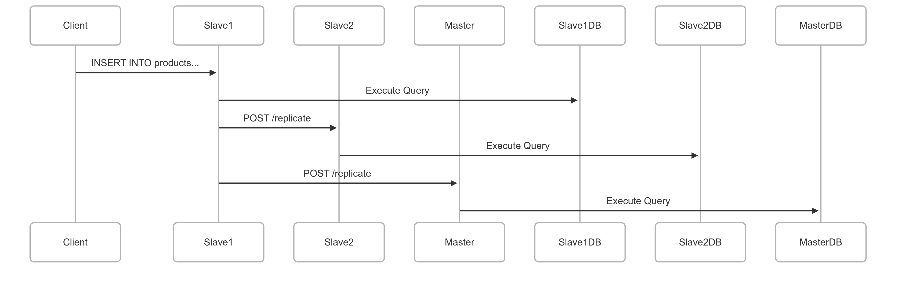

# **Final Project Report: Distributed E-Commerce Database System with Master-Slave Replication**

## **1. System Architecture Overview**

The system is a **distributed e-commerce database management system** that supports **master-slave replication** for high availability and fault tolerance. It consists of:

### **1.1 Components**

| Component                | Role                                                                                                                                                                                                    |
| ------------------------ | ------------------------------------------------------------------------------------------------------------------------------------------------------------------------------------------------------- |
| **Master Node**    | Handles all write operations (CREATE database and tables,DROP database ,INSERT, UPDATE, DELETE,SEARCH) and replicates changes to slaves.                                                              |
| **Slave Nodes**    | Read-only replicas that sync with the master and can propagate writes back to the master. Handles all write operations (INSERT, UPDATE, DELETE) and replicates changes to master andother slaves. |
| **MySQL Database** | Stores e-commerce data (customers, products, orders, orderItem).                                                                                                                                        |
| **HTTP API**       | RESTful endpoints for CRUD operations.                                                                                                                                                                  |
| **Web Interface**  | Admin dashboard for managing data.                                                                                                                                                                      |

### **1.2 Replication Workflow**

#### **1.2.1 From Master Side:**

1. **Write on Master**:

   - A client sends a write request (e.g., `INSERT INTO products`).
   - The master executes the query locally.
   - The master forwards the query to all slaves via HTTP POST `/replicate`.
2. **Slave Execution**:

   - Each slave receives the query and executes it.

#### **1.2.2 From Slaves Side:**

1. **Write on Master**:

   - A client sends a write request (e.g., `INSERT INTO products`).
   - The slave executes the query locally.
   - The slave forwards the query to master and all slaves via HTTP POST `/replicate`.
2. **Slave Execution**:

   - Each slave receives the query and executes it.
3. **master Execution**:

   - master receives the query and executes it.

---

## **2. Design Choices & Justifications**

### **2.1 Master-Slave Replication**

| Choice                                                                 | Reason                                                   | Alternative Considered                                  |
| ---------------------------------------------------------------------- | -------------------------------------------------------- | ------------------------------------------------------- |
| **HTTP-based replication** (instead of MySQL native replication) | Simpler to debug, works across different MySQL versions. | MySQL binlog replication (discarded due to complexity). |
| **Synchronous replication** (waits for slave confirmation)       | Ensures strong consistency.                              | Asynchronous (discarded for risk of data loss).         |
| **Slaves can forward writes**                                    | Allows admin actions from any node.                      | Master-only writes (discarded for flexibility).         |

### **2.2 Conflict Avoidance**

| Mechanism                                        | Purpose                       |
| ------------------------------------------------ | ----------------------------- |
| **Query UUID tagging**                     | Prevents duplicate execution. |
| **Origin tracking** (`master`/`slave`) | Stops infinite loops.         |
| **No re-broadcasting from slaves**         | Reduces network overhead.     |

### **2.3 Pagination & Search**

- **Offset-based pagination** (`LIMIT 5 OFFSET 10`)
- **Search** uses `LIKE` for name/email filtering.
- **Sorting** by `created_at`, `name`, or `order_count`.

---

## **3. Challenges & Solutions**

### **3.1 Infinite Replication Loops**

**Problem**: Slaves re-send queries, causing duplicates.**Solution**:

- Added `origin` field in replication requests.
- Slaves ignore queries they already processed.

### **3.2 Data Consistency Issues**

**Problem**: If master fails mid-replication, slaves may diverge.**Solution**:

- **Periodic checksum checks** (`SELECT COUNT(*) FROM products`).
- **Manual sync trigger** (`/force-sync` endpoint).

### **3.3 Network Latency**

**Problem**: Slow replication delays visibility.**Solution**:

- **Background goroutines** for async replication.
- **Exponential backoff** on retries.

---

## **4. Future Improvements**

1. **Switch to GTID-based replication** (MySQL Global Transaction ID) for better consistency.
2. **Add a load balancer** to distribute read requests across slaves.
3. **Implement automatic failover** (promote slave to master if master crashes).
4. **Use WebSockets** for real-time dashboard updates.

---
## 5. **Structure**

---
## **6. Conclusion**

The system successfully implements **master-slave replication** with **conflict resolution and** **scalable query handling.** While HTTP-based replication is simpler than MySQL-native methods, it ensures **cross-version compatibility** and **easier debugging**. Future work includes **GTID replication** and **auto-failover** for higher availability.

---

**Submited at:
Date**: 15/5/2025
**GitHub**: https://github.com/ShimaaAbdalraheem/Master-Slave-Replication
